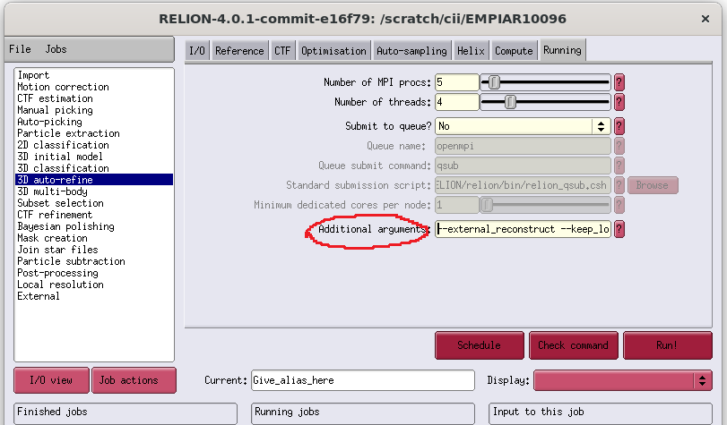

# spIsoNet Tutorial
spIsoNet (Single Particle IsoNet) is designed to correct for the preferred orientation problem in cryoEM by self-supervised deep learning, by recovering missing information from well-sampled orientations in Fourier space. 

Unlike conventional supervised deep learning methods that need explicit input-output pairs for training, spIsoNet autonomously extracts supervisory signals from the original data, ensuring the reliability of the information used for training. 

spIsoNet is designed for single particle analysis and subtomogram averaging. For the correcting missing wedge in cryoET, please refer to IsoNet.

# 1. Installation

We suggest using anaconda environment to manage the spIsoNet package.

Example commands to install spIsoNet

*Option 1:*
```
conda create -n spisonet python=3.10
conda activate spisonet
pip install torch --index-url https://download.pytorch.org/whl/cu118
cd <path to spIsoNet>
pip install .
```
and then set the following environment variable for Misalignment Correction
```
export RELION_EXTERNAL_RECONSTRUCT_EXECUTABLE="python <path to spIsoNet>/spIsoNet/bin/relion_wrapper.py"
export CONDA_ENV="spisonet"
```

*Option 2:*
```
conda env create -f setup.yml
conda activate spisonet
```

and then set the following environment variable for Misalignment Correction
```
export RELION_EXTERNAL_RECONSTRUCT_EXECUTABLE="python <path to spIsoNet>/spIsoNet/bin/relion_wrapper.py"
export CONDA_ENV="spisonet"
```

*Option 3:*
```
conda create -n spisonet python=3.10
conda activate spisonet
conda install -c "nvidia/label/cuda-11.8.0" cuda-toolkit
pip install torch --index-url https://download.pytorch.org/whl/cu118
pip install -r requirements.txt
```

and then set the following environment variable for Misalignment Correction
```
export RELION_EXTERNAL_RECONSTRUCT_EXECUTABLE="python <path to spIsoNet>/spIsoNet/bin/relion_wrapper.py"
export CONDA_ENV="spisonet"
export PATH=<path to spIsoNet>/spIsoNet/bin:$PATH
export PYTHONPATH=<path to spIsoNet>:$PYTHONPATH
```


The environment we verified are:
1. cuda11.8 cudnn8.5 pytorch2.0.1, pytorch installed with pip.
2. cuda11.3 cudnn8.2 pytorch1.13.1, pytorch installed with conda.

# 2. Anisotropy Correction

The default parameters in spIsoNet should be suitable for most cases.

## 2.0 prepare data set
The tutorial data can be downloaded here: https://www.ebi.ac.uk/emdb/EMD-8731?tab=interpretation


Two half maps: emd_8731_half_map_1.map and emd_8731_half_map_2.map and a solvent mask emd_8731_msk_1.map are needed to complete anistropy correction tutorial 

Please replease the file extension map to mrc.
```
mv emd_8731_half_map_1.map emd_8731_half_map_1.mrc
mv emd_8731_half_map_2.map emd_8731_half_map_2.mrc
mv emd_8731_msk_1.map emd_8731_msk_1.mrc
```

## 2.1. calculate 3DFSC

The algorithm for 3D FSC is customized based on
Tan, Y.Z., Baldwin, P.R., Davis, J.H., Williamson, J.R., Potter, C.S., Carragher, B. and Lyumkis, D., 2017. Addressing preferred specimen orientation in single-particle cryo-EM through tilting. Nature methods, 14(8), p.793.

The 3DFSC volume (the default file name is FSC3D.mrc) should be generated in a few minutes. This step does not use GPU accelation. You can use multiple cpu cores for parallelization by specifying "--ncpus".

Thie FSC3D.mrc will be used in the following reconstruct step as "aniso_file"

The input of 3D FSC calculation are two half maps and a solvent mask
``` {.bash language="bash"}
spisonet.py fsc3d emd_8731_half_map_1.mrc emd_8731_half_map_2.mrc emd_8731_msk_1.mrc --ncpus 16 
```

This will generate a 3DFSC volume called "FSC3D.mrc", which describes the Fourier shell correlation in different directions. 

You can also tune the --limit_res parameter to set the resolution limit of the 3D FSC calculation for recovery (default is the overall resolution of the map). 

```
11:07:17, INFO     [spisonet.py:552] Global resolution at FSC=0.143 is 4.191999816894532
11:07:17, INFO     [spisonet.py:555] Limit resolution to 4.191999816894532 for spIsoNet 3D calculation. 
11:07:17, INFO     [spisonet.py:557] calculating fast 3DFSC, this will take few minutes
100%|█████████████████████████████████████████████████████████████████████████████████████████████████████████████████████████████████████████████████████████████████████████████████████████████████████████████████████████████████████████████████████████| 80/80 [00:02<00:00, 28.95it/s]
100%|█████████████████████████████████████████████████████████████████████████████████████████████████████████████████████████████████████████████████████████████████████████████████████████████████████████████████████████████████████████████████████████| 80/80 [00:03<00:00, 24.20it/s]
11:07:23, INFO     [spisonet.py:562] voxel_size 1.309999942779541
```

## 2.2. Anisotropy Correction of the half maps

This step trains a network for Anisotropy Correction with "spisonet.py reconstruct".

This step will create a folder to store the output files of spIsoNet. The corrected map is stored as "correctedXXX.mrc" in that folder. You can also find trained neural network "XX.pt" and figure for loss change "loss.png" in the folder.  

The command to using single particle spIsoNet should be
``` {.bash language="bash"}
spisonet.py reconstruct emd_8731_half_map_1.mrc emd_8731_half_map_2.mrc --aniso_file FSC3D.mrc --mask emd_8731_msk_1.mrc --limit_res 3.5 --epochs 30 --alpha 1 --beta 0.5 --output_dir isonet_maps --gpuID 0,1,2,3 --acc_batches 2
```

Here is expected command line output
``` {.bash language="bash"}
11:13:15, INFO     [spisonet.py:466] voxel_size 1.309999942779541
11:13:24, INFO     [refine.py:239] Start preparing subvolumes!
11:13:24, INFO     [refine.py:242] Done preparing subvolumes!
11:13:24, INFO     [refine.py:244] Start training!
11:13:25, INFO     [network.py:202] Port number: 43963
learning rate 0.0003
(8, 9)
100%|████████████████████████████████████████████████████████████████████████████████████████████████████████████████████████████████████████████████████████████████████████████████████████████████████████████████████████████████████████| 250/250 [02:13<00:00,  1.87batch/s, Loss=0.598]
Epoch [1/30], Train Loss: 0.6581
 14%|█████████████████████████████████▌                                                                                                                                                                                                       | 36/250 [00:16<01:40,  2.14batch/s, Loss=0.533]
...

```
You can check the command line argument for the refine with the following command:
``` {.bash language="bash"}
spisonet.py reconstruct --help
```

## 2.3. Postprocessing

Postprocessing of the corrected halfmaps is not implemented in spIsoNet. You can use *relion_postprocess* to sharpen the corrected maps.


# 3. advanced topics

## 3.1 limit resolution
This parameter defined as the resolution limit for spIsoNet recovery. The maps will be first filtered to this resolution for the neural network training. After the network is trained, it will produced a "corrected_xx_filtered.mrc". Then the information beyond this resolution will be added to produce the final results "corrected_xx.mrc".

The higher resolution will introduce unreliable noise that may compromise the results. A lower value may lead to maps with partically recovered missing information. We tested that  the resolution at 0.143 or 3.5A could be good starting points to test this value. 

## 3.2 GPU memory consumption and acc_batches
Here is the table of GPU memory consumption. Based on our experience, larger batch size (> 4) works slightly better. 

acc_batches larger than 1 uses accumulate gradient to reduce memory consumption. Usually acc_batches can be 2 for most cases. If you have GPU with large memory, acc_batches = 1 should process slightly faster. 

batch_size should be divisible by acc_batches.
| Number of GPUs    | batch_size | acc_batches | memory useage per GPU |
| -------- | ------- | ------- | ------- |
| 1        | 4*      | 1       | ~17GB   |
| 1        | 4*      | 2*      | ~11GB   |
| 1        | 4*      | 4       | ~7GB    |
| 2        | 4*      | 1       | ~10GB   |
| 2        | 4*      | 2*      | ~7GB    |
| 4        | 8*      | 1       | ~10GB   |
| 4        | 8*      | 2*      | ~6GB    |
* means default values

## 3.3 predict directly or continue from a trained model
The single particle spIsoNet will generate a neuronal network model named xx.pt in the output folder, you can start from that model with the parameter "--pretrained_model".

Once you start with the pretrained model, you may also want to change the number of epochs to run. For example, the trained model is from the 10th epochs and you can train for another 10 epochs to make it equivalent to the 20 epochs from scratch.

You can also set "--epochs" to 0 together with "--pretrained_model" to only perform prediction without further training


## 3.4 Alpha and Beta weighting

The alpha value defines the weighting between the data consistency loss and the rotational equivarient loss. The default value 1 meaning putting equal weight on the two losses. The larger value means more weight on the rotational equivariant loss.

Empirically, the larger alpha value will results in smoother results. Please see the following images of corrected_half1.mrc with different alpha values.

<p align="center">  </p>

The beta value defines the weighting between missing information recovery and the denoising. The larger value leads to more denoised output maps. The default beta velue is 0.5. We typically do not change this value. 

## 3.5 run spIsoNet with a reliable reference
If you have a low resolution map of your sample that is reliable and with less severe perferred orientation, you can use this as a reference (with parameter --reference) for the spIsoNet reconstruct. This allows you to retain the low resolution information (defined with --ref_resolution parameter) from the reference in the spIsoNet reconstruct process. This may improve the results.

The default --ref_resolution is 10, this resolution should be much lower than the resolution of the reference. We recommand the reference resolution to be 10-20A. 

## 3.6 process two half maps independently
The noise2noise-based denoising is by default used in the spIsoNet anistropy correction process. It will produce cleaner and better maps. However, this denoising network will see both half1 and half2, which will break the independency of the two half maps.

You can specify the "--independent" as True to run the two half map independently, which will only perform missing information recovery without denoising. This step will train two networks each for one half map. The results generated from "--independent" reconstruction can be used for the "gold-standard" FSC calculation.  

## 3.7 Loss curve and epochs
The calculated with respective to the epochs is ploted and generated as a "png" file in the output folder. The loss function should gradually decrease throughout the training. Here is an example of the loss plot.

<p align="center">  </p>

Typically 30 epochs is sufficient. You can also increase the number of epochs to obtain a lower loss. 


# 4. Misalignment Correction
The particle alignment will nevertheless be influenced by distorted map with perferred orientation. This step is very useful in terms of generate a better alignment and subsqeuence a better cryoEM map.

This deep-learning approach spIsoNet can be used as a regularizer in the RELION refinement process. In each iteration of RELION refinement, spIsoNet can be used to perform the 3D reconstruction to generate corrected map and use that map for orientation search in RELION refine process.

We tested the RELION3.1 and RELION4.0 works for spIsoNet Misalignment Correction

After Misalignment Correction, you may further perform spIsoNet anistropy correction using the relion generated half maps to improve the map quality. 

The spIsoNet tutorial dataset can be downloaded from "https://ucla.box.com/s/0fwos64za746lcy2qd5jj1qhntu69ssg".
This is a subset of EMPIAR-10096, including particle star file, particle stack file, mask file and a low resolution reference. From this dataset, we can obetain a 3.5A resolution structure with spIsoNet Misalignment Correction.

## 4.1 Make sure spIsoNet is properly installed in a conda environment.

Install the required dependencies. This need a conda environment and a RELION installation. It is required to set the RELION_EXTERNAL_RECONSTRUCT_EXECUTABLE environment variable to point to relion_wrapper.py.
```
export RELION_EXTERNAL_RECONSTRUCT_EXECUTABLE="python <path to spIsoNet>/spIsoNet/bin/relion_wrapper.py"
export CONDA_ENV="spisonet"
export PATH=<path to spIsoNet>/spIsoNet/bin:$PATH
export PYTHONPATH=<path to spIsoNet>:$PYTHONPATH
```

## 4.2 Execute relion_wrapper.py script in RELION's relion_refine.
To execute the script relion_wrapper.py in relion_refine, it is necessary to add the argument "--external_reconstruct" in the command line, or by adding "--external_reconstruct" in the Additional Arguments section under the Running tab in RELION GUI.

Here is an example command:
``` {.bash language="bash"}
mpirun -np 5 `which relion_refine_mpi` --o Refine3D/job001/run --auto_refine --split_random_halves --i particles.star --ref reference.mrc --firstiter_cc --ini_high 10 --dont_combine_weights_via_disc --preread_images  --pool 30 --pad 2  --ctf --particle_diameter 170 --flatten_solvent --zero_mask --solvent_mask mask.mrc --solvent_correct_fsc  --oversampling 1 --healpix_order 2 --auto_local_healpix_order 5 --offset_range 5 --offset_step 2 --sym C3 --low_resol_join_halves 40 --norm --scale  --j 4 --gpu "" --external_reconstruct --keep_lowres --pipeline_control Refine3D/job001/
```

Here is the place for "--external_reconstruct":
<p align="center">  </p>

To use the spIsoNet, the relion refine command shoule contains:
1. "--external_reconstruct"
2. "--solvent_mask"
3. "--solvent_correct_fsc" 

If you have a reference that have a lower resolution but without perferred orientation. You can specify the "--keep_lowres" parameter, this command line argument is not recognized by relion bur can be recognized by spIsoNet. The limitation to retain the low resolution information from the reference is set by "--ini_high" paramter. With this parameter, the perfermance of the spIsoNet recovery and denoising might be improved.

In some severe cases, the "--keep_lowres" is necessaey. When the map generated by relion is not correct, it is important to keep the low resolution information from a correct reference throughout the image alignment. 


In the log file for relion, you should see this if the spIsoNet is running correctly in each iteration of Relion refine

```{.bash language="bash"}
 + Making system call for external reconstruction: python /home/cii/software/spIsoNet/bin/relion_wrapper.py Refine3D/job032/run_it025_half1_class001_external_reconstruct.star
iter = 025
set CUDA_VISIBLE_DEVICES=None
set CONDA_ENV=torch_cuda12.0_glados_py3.10
set ISONET_WHITENING=True
set ISONET_WHITENING_LOW=10
set ISONET_RETRAIN_EACH_ITER=True
set ISONET_BETA=0.5
set ISONET_ALPHA=1
set ISONET_START_HEALPIX=4
set ISONET_ACC_BATCHES=2
set ISONET_EPOCHS=5
set ISONET_START_EPOCHS=5
set ISONET_KEEP_LOWRES=True
set ISONET_LOWPASS=True
set ISONET_ANGULAR_WHITEN=True
set ISONET_3DFSD=False
set ISONET_FSC_05=False
set ISONET_FSC_WEIGHTING=True
healpix = 7
symmetry = C3
mask_file = relion31maptightmask.mrc
pixel size = 1.309998
resolution at 0.5 and 0.143 are 3.992381 and 3.422041
real limit resolution to 3.422041
 eval "$(conda shell.bash hook)" && conda activate torch_cuda12.0_glados_py3.10 &&  spisonet.py whitening  Refine3D/job032/run_it025_half1_class001_unfil.mrc -o Refine3D/job032/run_it025_half1_class001_unfil.mrc --mask relion31maptightmask.mrc --high_res 3.422041 --low_res 10
 eval "$(conda shell.bash hook)" && conda activate torch_cuda12.0_glados_py3.10 &&  spisonet.py whitening  Refine3D/job032/run_it025_half2_class001_unfil.mrc -o Refine3D/job032/run_it025_half2_class001_unfil.mrc --mask relion31maptightmask.mrc --high_res 3.422041 --low_res 10
 eval "$(conda shell.bash hook)" && conda activate torch_cuda12.0_glados_py3.10 &&  spisonet.py combine_map  Refine3D/job032/run_it000_half2_class001.mrc Refine3D/job032/run_it025_half2_class001_unfil.mrc Refine3D/job032/run_it025_half2_class001_unfil.mrc 10.0 --mask_file relion31maptightmask.mrc
 eval "$(conda shell.bash hook)" && conda activate torch_cuda12.0_glados_py3.10 &&  spisonet.py combine_map  Refine3D/job032/run_it000_half1_class001.mrc Refine3D/job032/run_it025_half1_class001_unfil.mrc Refine3D/job032/run_it025_half1_class001_unfil.mrc 10.0 --mask_file relion31maptightmask.mrc
relion_image_handler --i Refine3D/job032/run_it025_half1_class001_unfil.mrc --o Refine3D/job032/run_it025_half1_class001_unfil_lowpass_backup.mrc --lowpass 3.422041; cp Refine3D/job032/run_it025_half1_class001_unfil_lowpass_backup.mrc Refine3D/job032/run_it025_half1_class001_unfil.mrc
relion_image_handler --i Refine3D/job032/run_it025_half2_class001_unfil.mrc --o Refine3D/job032/run_it025_half2_class001_unfil_lowpass_backup.mrc --lowpass 3.422041; cp Refine3D/job032/run_it025_half2_class001_unfil_lowpass_backup.mrc Refine3D/job032/run_it025_half2_class001_unfil.mrc
18:34:04, INFO     [spisonet.py:431] Limit resolution to 3.422041 for spIsoNet 3D FSC calculation. You can also tune this paramerter with --limit_res .
18:34:04, INFO     [spisonet.py:433] calculating fast 3DFSC, this will take few minutes
18:34:35, INFO     [spisonet.py:440] voxel_size 1.3099980354309082
Refine3D/job032/run_it024_half_class001_unfil.pt
retrain network each relion iteration
 eval "$(conda shell.bash hook)" && conda activate torch_cuda12.0_glados_py3.10 &&  spisonet.py refine_n2n  Refine3D/job032/run_it025_half1_class001_unfil.mrc Refine3D/job032/run_it025_half2_class001_unfil.mrc Refine3D/job032/run_it025_3DFSC.mrc --epochs 5 --n_subvolume 1000 --acc_batches 2 --alpha 1 --beta 0.4 --output_dir Refine3D/job032 --gpuID None --limit_res 3.422041 --mask relion31maptightmask.mrc
using all GPUs in this node: 0,1,2,3
18:34:46, INFO     [utils.py:15] The Refine3D/job032 folder already exists, outputs will write into this folder
18:34:46, INFO     [spisonet.py:224] voxel_size 1.3099980354309082
run_it025_half_class001_unfil
18:34:46, INFO     [refine.py:299] Filter map to resolution 3.422041 for spIsoNet correction!
18:34:56, INFO     [refine.py:311] Start preparing subvolumes!
18:34:56, INFO     [refine.py:314] Done preparing subvolumes!
18:34:56, INFO     [refine.py:316] Start training!
18:34:56, INFO     [network_n2n.py:232] Port number: 42765
learning rate 0.0003
['Refine3D/job032/run_it025_half1_class001_unfil_data', 'Refine3D/job032/run_it025_half2_class001_unfil_data']
Epoch [1/5], Train Loss: 0.9726
Epoch [2/5], Train Loss: 0.8730
Epoch [3/5], Train Loss: 0.8548
Epoch [4/5], Train Loss: 0.8424
Epoch [5/5], Train Loss: 0.8300
18:38:58, DEBUG    [__init__.py:337] matplotlib data path: /home/cii/anaconda3/envs/torch_cuda12.0_glados_py3.10/lib/python3.10/site-packages/matplotlib/mpl-data
18:38:58, DEBUG    [__init__.py:337] CONFIGDIR=/home/cii/.config/matplotlib
18:38:58, DEBUG    [__init__.py:1498] interactive is False
18:38:58, DEBUG    [__init__.py:1499] platform is linux
18:38:58, DEBUG    [__init__.py:337] CACHEDIR=/home/cii/.cache/matplotlib
18:38:58, DEBUG    [font_manager.py:1574] Using fontManager instance from /home/cii/.cache/matplotlib/fontlist-v330.json
18:38:59, INFO     [refine.py:346] Start predicting!
data_shape torch.Size([125, 1, 80, 80, 80])
size restored (334, 334, 334)
data_shape torch.Size([125, 1, 80, 80, 80])
size restored (334, 334, 334)
18:39:11, INFO     [refine.py:369] Done predicting
18:39:11, INFO     [spisonet.py:250] combining
18:39:11, INFO     [spisonet.py:335] voxel_size 1.3099980354309082
18:39:23, INFO     [spisonet.py:335] voxel_size 1.3099980354309082
18:39:34, INFO     [spisonet.py:254] Finished
finished spisonet reconstruction
 + External reconstruction finished successfully, reading result back in ... 
8.80/8.80 min ............................................................~~(,_,">

```

## 4.3 Environment variables for the RELION wrapper.

To tune the parameter of spIsoNet Misalignment Correction, you can set up more linux environemnt variables as follows:

1. set which GPU(s) you can use by sepecify the CUDA_VISIBLE_DEVICES. By default, spIsoNet will use up all the avaliable GPUs 
```
export CUDA_VISIBLE_DEVICES="0"
```

2. ISONET_BETA value will define the denoising level of the network. See section 2.4

```
export ISONET_BETA=0.5
```

3. ISONET_ALPHA value define the balance between the data consistency loss and rotation equivariance loss. Default value 1 should work for most cases. Setting this to zero is not recommand and will ignore rotation equivariance loss. See section 2.4
```
export ISONET_ALPHA=1
```

4. START_HEALPIX defines at which angular sampling step and the resolution the spIsoNet training will be performed.
```
ISONET_START_HEALPIX=3
ISONET_START_RESOLUTION=15
```

5. ISONET_RETRAIN_EACH_ITER defines whether the network should be retrained from scratch or from previous iteration of relion refine. This is typically set to True
```
ISONET_RETRAIN_EACH_ITER=True
```

6. ISONET_EPOCHS defines how many epochs to train the neural network.
```
ISONET_EPOCHS=5
```

7. ISONET_ACC_BATCHES defines how many small batches for each batch. If you have GPUs with large memory you can set it to 1.
```
ISONET_ACC_BATCHES=2
```

8. ISONET_KEEP_LOWRES define whether low resolution information from a correct reference is kept in the alignment. This parameter can be overwrite by the --keep_lowres parameter in relion command or GUI
```
ISONET_KEEP_LOWRES=False
```

9. ISONET_WHITENING define whether whighting is performed before running spIsoNet. Typical we set this as True.
ISONET_WHITENING_LOW defines the starting resolution for whitening.
```
ISONET_WHITENING=True
ISONET_WHITENING_LOW=10
```
10. ISONET_FSC_WEIGHTING define whether FSC weighting is performed before running spIsoNet. Typical we set this as True.
```
ISONET_FSC_WEIGHTING=True
```
